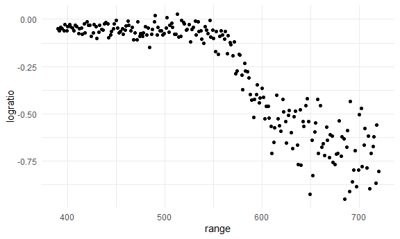
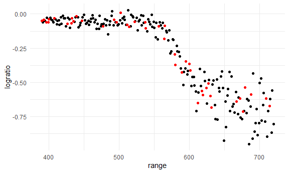
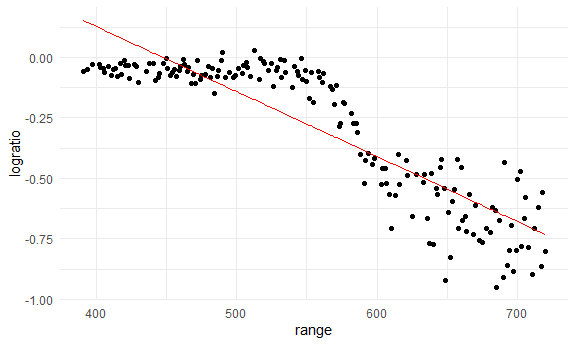
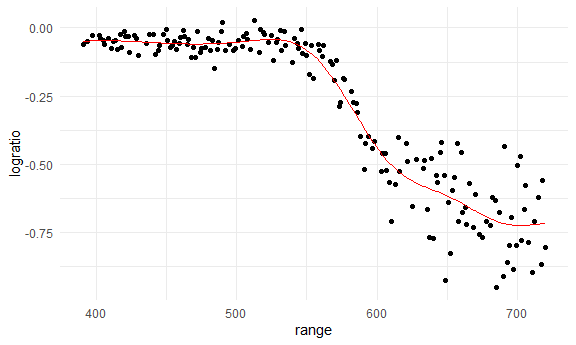
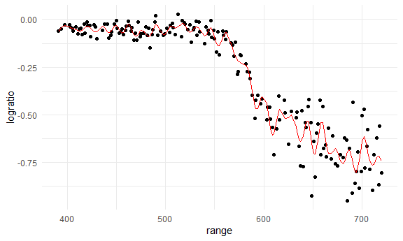
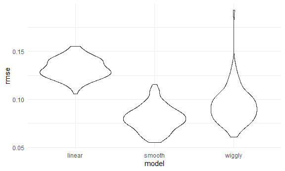
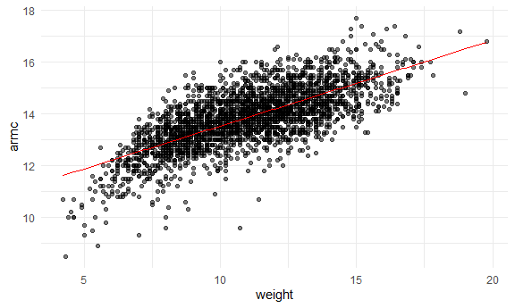
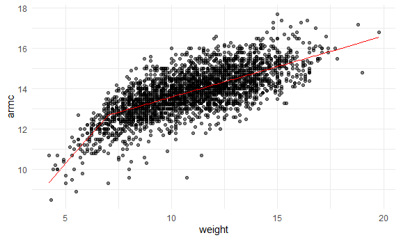
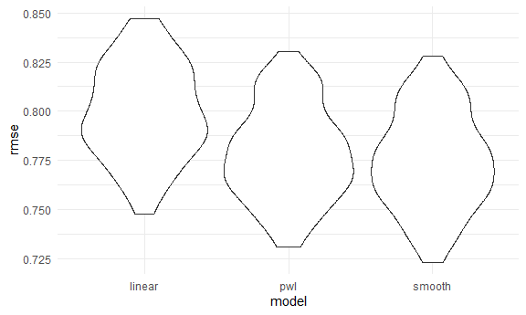

Cross Validation
================

Load key packages.

``` r
library(tidyverse)
library(p8105.datasets)
library(modelr)
```

Load the LIDAR

``` r
data("lidar")
```

Look at the data

``` r
lidar 
```

    ## # A tibble: 221 × 2
    ##    range logratio
    ##    <dbl>    <dbl>
    ##  1   390  -0.0504
    ##  2   391  -0.0601
    ##  3   393  -0.0419
    ##  4   394  -0.0510
    ##  5   396  -0.0599
    ##  6   397  -0.0284
    ##  7   399  -0.0596
    ##  8   400  -0.0399
    ##  9   402  -0.0294
    ## 10   403  -0.0395
    ## # ℹ 211 more rows

``` r
lidar_df = 
  lidar |> 
  mutate(id = row_number())

lidar_df |> 
  ggplot(aes(x = range, y = logratio)) + 
  geom_point()
```



``` r
# non-constant variance
```

## Create dataframes

``` r
train_df = 
  sample_frac(lidar_df, size = .8) |> 
  arrange(id)

test_df = anti_join(lidar_df, train_df, by = "id") # rows in lidar_df that aren't in the train_df
```

Look at these

``` r
ggplot(train_df, aes(x = range, y = logratio)) + 
  geom_point() + 
  geom_point(data = test_df, color = "red")
```



``` r
# shows training and testing data
```

Fit a few models to `train_df`.

``` r
# linear model that takes log ratio
linear_mod = lm(logratio ~ range, data = train_df)

# non-linear model fitting
smooth_mod = mgcv::gam(logratio ~ s(range), data = train_df)

# adding in parameters (k), don't do this because this model is overfitting
wiggly_mod = mgcv::gam(logratio ~ s(range, k = 50), sp = 10e-8, data = train_df)
```

Look at this!!

``` r
# Fit linear model
train_df |> 
  add_predictions(linear_mod) |> 
  ggplot(aes(x = range, y = logratio)) + 
  geom_point() + 
  geom_line(aes(y = pred), color = "red")
```



``` r
# Fit non-linear model
train_df |> 
  add_predictions(smooth_mod) |> 
  ggplot(aes(x = range, y = logratio)) + 
  geom_point() + 
  geom_line(aes(y = pred), color = "red")
```



``` r
# Fit wiggly model
train_df |> 
  add_predictions(wiggly_mod) |> 
  ggplot(aes(x = range, y = logratio)) + 
  geom_point() + 
  geom_line(aes(y = pred), color = "red")
```



Try computing our RMSEs

``` r
# testing models on testing dataset (want to minimize RMSE)
rmse(linear_mod, test_df) # not good
```

    ## [1] 0.12125

``` r
rmse(smooth_mod, test_df) # best model
```

    ## [1] 0.05681892

``` r
rmse(wiggly_mod, test_df) # not good
```

    ## [1] 0.07007133

## ITERATE!!

``` r
cv_df = 
  # 80/20 split by default
  crossv_mc(lidar_df, n = 100) |> # doing split 100 times
  mutate(
    train = map(train, as_tibble),
    test = map(test, as_tibble)
  )
```

Did this work? Yes!

``` r
# third training/testing split
cv_df |> pull(train) |> nth(3)
```

    ## # A tibble: 176 × 3
    ##    range logratio    id
    ##    <dbl>    <dbl> <int>
    ##  1   391  -0.0601     2
    ##  2   393  -0.0419     3
    ##  3   394  -0.0510     4
    ##  4   396  -0.0599     5
    ##  5   399  -0.0596     7
    ##  6   400  -0.0399     8
    ##  7   402  -0.0294     9
    ##  8   403  -0.0395    10
    ##  9   405  -0.0476    11
    ## 10   406  -0.0604    12
    ## # ℹ 166 more rows

Let’s fit models over and over.

``` r
lidar_lm = function(df) {
  
  lm(logratio ~ range, data = df)
  
}

cv_df |>
  mutate(
    linear_fits = map(train, lidar_lm)
  )
```

    ## # A tibble: 100 × 4
    ##    train              test              .id   linear_fits
    ##    <list>             <list>            <chr> <list>     
    ##  1 <tibble [176 × 3]> <tibble [45 × 3]> 001   <lm>       
    ##  2 <tibble [176 × 3]> <tibble [45 × 3]> 002   <lm>       
    ##  3 <tibble [176 × 3]> <tibble [45 × 3]> 003   <lm>       
    ##  4 <tibble [176 × 3]> <tibble [45 × 3]> 004   <lm>       
    ##  5 <tibble [176 × 3]> <tibble [45 × 3]> 005   <lm>       
    ##  6 <tibble [176 × 3]> <tibble [45 × 3]> 006   <lm>       
    ##  7 <tibble [176 × 3]> <tibble [45 × 3]> 007   <lm>       
    ##  8 <tibble [176 × 3]> <tibble [45 × 3]> 008   <lm>       
    ##  9 <tibble [176 × 3]> <tibble [45 × 3]> 009   <lm>       
    ## 10 <tibble [176 × 3]> <tibble [45 × 3]> 010   <lm>       
    ## # ℹ 90 more rows

``` r
cv_df =
  cv_df |> 
  mutate(
    linear_fits = map(train, \(df) lm(logratio ~ range, data = df)),
    smooth_fits = map(train, \(df) mgcv::gam(logratio ~ s(range), data = df)),
    wiggly_fits = map(train, \(df) mgcv::gam(logratio ~ s(range, k = 50), sp = 10e-8, data = df))
  ) |> 
  mutate(
    # compute the RMSE for the different models
    rmse_linear = map2_dbl(linear_fits, test, rmse),
    rmse_smooth = map2_dbl(smooth_fits, test, rmse),
    rmse_wiggly = map2_dbl(wiggly_fits, test, rmse)
  )
```

Let’s try to look at this better.

``` r
cv_df |> 
  select(starts_with("rmse")) |> 
  pivot_longer(
    everything(),
    names_to = "model",
    values_to = "rmse",
    names_prefix = "rmse_"
  ) |>  # creates 2 columns (model and rmse)
  ggplot(aes(x = model, y = rmse)) + 
  geom_violin()
```



``` r
# smooth model is best
```

## Child growth

``` r
growth_df = 
  read_csv("data/nepalese_children.csv")
```

    ## Rows: 2705 Columns: 5
    ## ── Column specification ────────────────────────────────────────────────────────
    ## Delimiter: ","
    ## dbl (5): age, sex, weight, height, armc
    ## 
    ## ℹ Use `spec()` to retrieve the full column specification for this data.
    ## ℹ Specify the column types or set `show_col_types = FALSE` to quiet this message.

Weight v arm_c (arm circumference)

``` r
growth_df |> 
  ggplot(aes(x = weight, y = armc)) + 
  geom_point(alpha = .5)
```


``` r
# has potential for non-linear association
```

Let’s show the models we might use.

``` r
growth_df =
  growth_df |> 
  mutate(
    # weight_cp is weight change point
    weight_cp7 = (weight > 7) * (weight - 7)
  )
```

Let’s fit three models

``` r
linear_mod = lm(armc ~ weight, data = growth_df)
pwl_mod = lm(armc ~ weight + weight_cp7, data = growth_df)
smooth_mod = mgcv::gam(armc ~ s(weight), data = growth_df)
```

``` r
growth_df |> 
  add_predictions(linear_mod) |> 
  ggplot(aes(x = weight, y = armc)) +
  geom_point(alpha = .5) + 
  geom_line(aes(y = pred), color = "red")
```



``` r
# working pretty well but need to fix something
```

``` r
growth_df |> 
  add_predictions(pwl_mod) |> 
  ggplot(aes(x = weight, y = armc)) +
  geom_point(alpha = .5) + 
  geom_line(aes(y = pred), color = "red")
```



``` r
# accounts for weight change at the beginning
```

``` r
growth_df |> 
  add_predictions(smooth_mod) |> 
  ggplot(aes(x = weight, y = armc)) +
  geom_point(alpha = .5) + 
  geom_line(aes(y = pred), color = "red")
```


``` r
# gives smoothed out end
```

Now cross validate!

``` r
cv_df = 
  crossv_mc(growth_df, n = 100) |> 
  mutate(
    train = map(train, as_tibble),
    test = map(test, as_tibble)
  )
```

``` r
cv_df = 
  cv_df |> 
  mutate(
    linear_mod = map(train, \(df) lm(armc ~ weight, data = df)),
    pwl_mod = map(train, \(df) lm(armc ~ weight + weight_cp7, data = df)),
    smooth_mod = map(train, \(df) mgcv::gam(armc ~ s(weight), data = df))
  ) |> 
  mutate(
    rmse_linear = map2_dbl(linear_mod, test, rmse),
    rmse_pwl    = map2_dbl(pwl_mod, test, rmse),
    rmse_smooth = map2_dbl(smooth_mod, test, rmse)
  )
```

Create my boxplots!

``` r
cv_df |> 
  select(starts_with("rmse")) |> 
  pivot_longer(
    everything(),
    names_to = "model",
    values_to = "rmse",
    names_prefix = "rmse_"
  ) |> 
  ggplot(aes(x = model, y = rmse)) + 
  geom_violin()
```



``` r
# linear model underperforming compared to the other models
```
