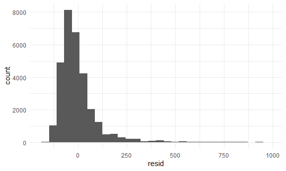
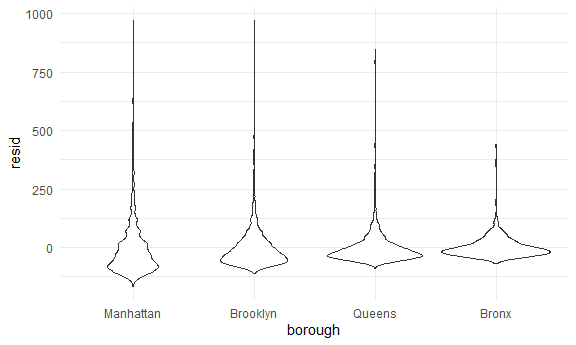
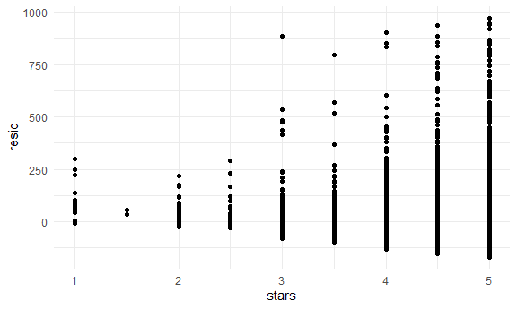
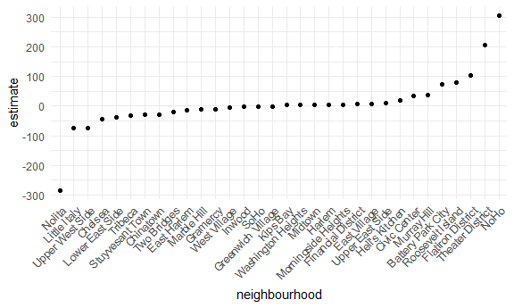

Linear Models
================

Load key packages.

``` r
library(tidyverse)
library(p8105.datasets)
```

Load the NYC airbnb data.

``` r
data(nyc_airbnb)
```

Look at the data / do some cleaning.

``` r
nyc_airbnb = 
  nyc_airbnb |> 
  mutate(
    stars = review_scores_location / 2
  ) |> 
  rename(
    borough = neighbourhood_group
  ) |> 
  filter(borough != "Staten Island") |> # not enough airbnbs in Staten Island to do regression
  select(price, stars, borough, room_type, neighbourhood)
```

Do regression!!!

``` r
fit = lm(price ~ stars + borough, data = nyc_airbnb)
fit # gives coefficient estimates
```

    ## 
    ## Call:
    ## lm(formula = price ~ stars + borough, data = nyc_airbnb)
    ## 
    ## Coefficients:
    ##      (Intercept)             stars   boroughBrooklyn  boroughManhattan  
    ##           -70.41             31.99             40.50             90.25  
    ##    boroughQueens  
    ##            13.21

``` r
# R converts borough (a character variable) into a factors and turns it into alphabetical order
# reference group is Bronx here
```

do some additional cleaning then refit.

``` r
nyc_airbnb |> 
  count(borough)
```

    ## # A tibble: 4 × 2
    ##   borough       n
    ##   <chr>     <int>
    ## 1 Bronx       649
    ## 2 Brooklyn  16810
    ## 3 Manhattan 19212
    ## 4 Queens     3821

``` r
nyc_airbnb = 
  nyc_airbnb |> 
  mutate(
    borough = fct_infreq(borough), # in order of how common (most appearances to least)
    room_type = fct_infreq(room_type)
  )

fit = lm(price ~ stars + borough, data = nyc_airbnb)
fit
```

    ## 
    ## Call:
    ## lm(formula = price ~ stars + borough, data = nyc_airbnb)
    ## 
    ## Coefficients:
    ##     (Intercept)            stars  boroughBrooklyn    boroughQueens  
    ##           19.84            31.99           -49.75           -77.05  
    ##    boroughBronx  
    ##          -90.25

``` r
# reference is Manhattan here
# intercept is the expected price of a rental in Manhattan when stars equal to 0
# Brooklyn is $50 cheaper than Manhattan
# Queens is $77 cheaper than Manhattan
```

Look at `lm` stuff

``` r
summary(fit) # tells you about residuals, estimates, p-values, R^2
names(summary(fit))
summary(fit)[["coefficients"]] # pulls out coefficients table
summary(fit)[["df"]] # pulls out degrees of freedom

fitted.values(fit) # fitted values for all rows in the data frame
resid(fit)
```

Look at cleaner `lm` stuff

``` r
fit |> 
  broom::tidy() |> 
  mutate(
    term = str_replace(term, "borough", "Borough: ")
  ) |> 
  select(term, estimate, p.value) |> 
  knitr::kable(digits = 3)
```

| term              | estimate | p.value |
|:------------------|---------:|--------:|
| (Intercept)       |   19.839 |   0.104 |
| stars             |   31.990 |   0.000 |
| Borough: Brooklyn |  -49.754 |   0.000 |
| Borough: Queens   |  -77.048 |   0.000 |
| Borough: Bronx    |  -90.254 |   0.000 |

``` r
# nicely formatted table

fit |> 
  broom::glance() # gives important info you might need
```

    ## # A tibble: 1 × 12
    ##   r.squared adj.r.squared sigma statistic   p.value    df   logLik    AIC    BIC
    ##       <dbl>         <dbl> <dbl>     <dbl>     <dbl> <dbl>    <dbl>  <dbl>  <dbl>
    ## 1    0.0342        0.0341  182.      271. 6.73e-229     4 -202113. 4.04e5 4.04e5
    ## # ℹ 3 more variables: deviance <dbl>, df.residual <int>, nobs <int>

## Diagnostics

Look at residuals.

``` r
nyc_airbnb |> 
  modelr::add_residuals(fit) |> # computes residuals and adds it to the data frame
  modelr::add_predictions(fit) |> # gives predicted values
  filter(resid < 1000) |> 
  ggplot(aes(x = resid)) + 
  geom_histogram()
```

    ## `stat_bin()` using `bins = 30`. Pick better value `binwidth`.



``` r
# histogram of residual values, most residuals centered around 0

nyc_airbnb |> 
  modelr::add_residuals(fit) |> 
  modelr::add_predictions(fit) |> 
  filter(resid < 1000) |> 
  ggplot(aes(x = borough, y = resid)) + 
  geom_violin()
```



``` r
# shows residual distribution across boroughs
# doesn't look like there's a constant variation across boroughs
# Manhattan has a wider distribution, more negative and highly skewed, others are increasingly narrowed

nyc_airbnb |> 
  modelr::add_residuals(fit) |> 
  modelr::add_predictions(fit) |> 
  filter(resid < 1000) |> 
  ggplot(aes(x = stars, y = resid)) + 
  geom_point()
```



``` r
# distribution of residuals according to stars
# less skewness and variability for airbnbs with less stars
```

## Hypothesis testing

``` r
fit |> 
  broom::tidy()
```

    ## # A tibble: 5 × 5
    ##   term            estimate std.error statistic   p.value
    ##   <chr>              <dbl>     <dbl>     <dbl>     <dbl>
    ## 1 (Intercept)         19.8     12.2       1.63 1.04e-  1
    ## 2 stars               32.0      2.53     12.7  1.27e- 36
    ## 3 boroughBrooklyn    -49.8      2.23    -22.3  6.32e-109
    ## 4 boroughQueens      -77.0      3.73    -20.7  2.58e- 94
    ## 5 boroughBronx       -90.3      8.57    -10.5  6.64e- 26

``` r
# estimates for each individual coefficients
```

What about a categorical variable?

``` r
fit_alt = lm(price ~ stars + borough + room_type, data = nyc_airbnb)
fit_null = lm(price ~ stars + borough, data = nyc_airbnb)
# compare these two models (one has room type and other doesn't)

anova(fit_null, fit_alt) |> 
  broom::tidy()
```

    ## # A tibble: 2 × 7
    ##   term                        df.residual    rss    df   sumsq statistic p.value
    ##   <chr>                             <dbl>  <dbl> <dbl>   <dbl>     <dbl>   <dbl>
    ## 1 price ~ stars + borough           30525 1.01e9    NA NA            NA       NA
    ## 2 price ~ stars + borough + …       30523 9.21e8     2  8.42e7     1394.       0

``` r
# really small p-value tells us room type matters
```

## Interactions vs nested data

``` r
# stars might be associated with borough, effect of stars differs from one borough to the next
# room type might also be associated with borough
# Interactions tell you how does one variable modify the main effect of another variable?
fit_interactions =
  lm(price ~ stars * borough + room_type * borough, data = nyc_airbnb)


fit_interactions |> 
  broom::tidy()
```

    ## # A tibble: 16 × 5
    ##    term                                  estimate std.error statistic  p.value
    ##    <chr>                                    <dbl>     <dbl>     <dbl>    <dbl>
    ##  1 (Intercept)                              95.7      19.2     4.99   6.13e- 7
    ##  2 stars                                    27.1       3.96    6.84   8.20e-12
    ##  3 boroughBrooklyn                         -26.1      25.1    -1.04   2.99e- 1
    ##  4 boroughQueens                            -4.12     40.7    -0.101  9.19e- 1
    ##  5 boroughBronx                             -5.63     77.8    -0.0723 9.42e- 1
    ##  6 room_typePrivate room                  -124.        3.00  -41.5    0       
    ##  7 room_typeShared room                   -154.        8.69  -17.7    1.42e-69
    ##  8 stars:boroughBrooklyn                    -6.14      5.24   -1.17   2.41e- 1
    ##  9 stars:boroughQueens                     -17.5       8.54   -2.04   4.09e- 2
    ## 10 stars:boroughBronx                      -22.7      17.1    -1.33   1.85e- 1
    ## 11 boroughBrooklyn:room_typePrivate room    32.0       4.33    7.39   1.55e-13
    ## 12 boroughQueens:room_typePrivate room      54.9       7.46    7.37   1.81e-13
    ## 13 boroughBronx:room_typePrivate room       71.3      18.0     3.96   7.54e- 5
    ## 14 boroughBrooklyn:room_typeShared room     47.8      13.9     3.44   5.83e- 4
    ## 15 boroughQueens:room_typeShared room       58.7      17.9     3.28   1.05e- 3
    ## 16 boroughBronx:room_typeShared room        83.1      42.5     1.96   5.03e- 2

``` r
# affect of increasing stars in Brooklyn is 27.1 - 6.14
```

Let’s just look at Brooklyn first.

``` r
nyc_airbnb |> 
  filter(borough == "Brooklyn") |> 
  lm(price ~ stars + room_type, data = _) |> # _ indicates data frame
  broom::tidy()
```

    ## # A tibble: 4 × 5
    ##   term                  estimate std.error statistic   p.value
    ##   <chr>                    <dbl>     <dbl>     <dbl>     <dbl>
    ## 1 (Intercept)               69.6     14.0       4.96 7.27e-  7
    ## 2 stars                     21.0      2.98      7.05 1.90e- 12
    ## 3 room_typePrivate room    -92.2      2.72    -34.0  6.40e-242
    ## 4 room_typeShared room    -106.       9.43    -11.2  4.15e- 29

``` r
# affect of stars and room type in Brooklyn

nyc_airbnb |> 
  filter(borough == "Manhattan") |> 
  lm(price ~ stars + room_type, data = _) |> 
  broom::tidy()
```

    ## # A tibble: 4 × 5
    ##   term                  estimate std.error statistic   p.value
    ##   <chr>                    <dbl>     <dbl>     <dbl>     <dbl>
    ## 1 (Intercept)               95.7     22.2       4.31 1.62e-  5
    ## 2 stars                     27.1      4.59      5.91 3.45e-  9
    ## 3 room_typePrivate room   -124.       3.46    -35.8  9.40e-270
    ## 4 room_typeShared room    -154.      10.1     -15.3  2.47e- 52

``` r
nyc_airbnb |> 
  filter(borough == "Bronx") |> 
  lm(price ~ stars + room_type, data = _) |> 
  broom::tidy()
```

    ## # A tibble: 4 × 5
    ##   term                  estimate std.error statistic  p.value
    ##   <chr>                    <dbl>     <dbl>     <dbl>    <dbl>
    ## 1 (Intercept)              90.1      15.2       5.94 5.73e- 9
    ## 2 stars                     4.45      3.35      1.33 1.85e- 1
    ## 3 room_typePrivate room   -52.9       3.57    -14.8  6.21e-41
    ## 4 room_typeShared room    -70.5       8.36     -8.44 4.16e-16

``` r
nyc_airbnb |> 
  filter(borough == "Queens") |> 
  lm(price ~ stars + room_type, data = _) |> 
  broom::tidy()
```

    ## # A tibble: 4 × 5
    ##   term                  estimate std.error statistic  p.value
    ##   <chr>                    <dbl>     <dbl>     <dbl>    <dbl>
    ## 1 (Intercept)              91.6      25.8       3.54 4.00e- 4
    ## 2 stars                     9.65      5.45      1.77 7.65e- 2
    ## 3 room_typePrivate room   -69.3       4.92    -14.1  1.48e-43
    ## 4 room_typeShared room    -95.0      11.3      -8.43 5.52e-17

Write a short function

``` r
# computes specific linear model based on what data is inputted
lm_airbnb = function(df) {
  
  lm(price ~ stars + room_type, data = df)
  
}

nyc_airbnb |> 
  filter(borough == "Queens") |> 
  lm_airbnb() |> # inputs data frame subset to Queens
  broom::tidy()
```

    ## # A tibble: 4 × 5
    ##   term                  estimate std.error statistic  p.value
    ##   <chr>                    <dbl>     <dbl>     <dbl>    <dbl>
    ## 1 (Intercept)              91.6      25.8       3.54 4.00e- 4
    ## 2 stars                     9.65      5.45      1.77 7.65e- 2
    ## 3 room_typePrivate room   -69.3       4.92    -14.1  1.48e-43
    ## 4 room_typeShared room    -95.0      11.3      -8.43 5.52e-17

Create a list of dataframes, and iterate to fit the model each time.

``` r
nested_lm_results = 
  nyc_airbnb |> 
  nest(data = -borough) |> # nest everything except borough, created column of data frames I care about
  mutate(
    fits = map(data, lm_airbnb), # fits column includes linear model fits for each borough
    results = map(fits, broom::tidy) # results column includes cleaned up data frames for lm fits for each borough
  ) |> 
  select(borough, results) |> 
  unnest(results)
```

Do some untidying.

``` r
nested_lm_results |> 
  select(borough, term, estimate) |> 
  pivot_wider(
    names_from = term, 
    values_from = estimate
  )
```

    ## # A tibble: 4 × 5
    ##   borough   `(Intercept)` stars `room_typePrivate room` `room_typeShared room`
    ##   <fct>             <dbl> <dbl>                   <dbl>                  <dbl>
    ## 1 Bronx              90.1  4.45                   -52.9                  -70.5
    ## 2 Queens             91.6  9.65                   -69.3                  -95.0
    ## 3 Brooklyn           69.6 21.0                    -92.2                 -106. 
    ## 4 Manhattan          95.7 27.1                   -124.                  -154.

``` r
# stars has biggest impact in Manhattan and Brooklyn
# affect of private room in Manhattan is more negative than the affect of private room in Bronx
# we don't have p-valuess so we can't tell if affect of stars is statistically significant across boroughs
```

Use an *anonymous* function instead of `lm_airbnb`

``` r
# using a function that doesn't really exist, in the data frame
nested_lm_results = 
  nyc_airbnb |> 
  nest(data = -borough) |> 
  mutate(
    fits = map(data, \(df) lm(price ~ stars + room_type, data = df)), # inputted the lm function here
    results = map(fits, broom::tidy)
  ) |> 
  select(borough, results) |> 
  unnest(results)

nested_lm_results |> 
  select(borough, term, estimate) |> 
  pivot_wider(
    names_from = term, 
    values_from = estimate
  )
```

    ## # A tibble: 4 × 5
    ##   borough   `(Intercept)` stars `room_typePrivate room` `room_typeShared room`
    ##   <fct>             <dbl> <dbl>                   <dbl>                  <dbl>
    ## 1 Bronx              90.1  4.45                   -52.9                  -70.5
    ## 2 Queens             91.6  9.65                   -69.3                  -95.0
    ## 3 Brooklyn           69.6 21.0                    -92.2                 -106. 
    ## 4 Manhattan          95.7 27.1                   -124.                  -154.

``` r
# use fct_reorder() if you want to recode the categorical variables such as borough
```

Let’s do an even more extreme example!!

``` r
manhattan_analysis =
  nyc_airbnb |> 
  filter(
    borough == "Manhattan"
  ) |> 
  nest(data = -neighbourhood) |> # separate dataset for each of the 32 neighborhoods
  mutate(
    fits = map(data, \(df) lm(price ~ stars + room_type, data = df)), # use anonymous function
    results = map(fits, broom::tidy)
  ) |> 
  select(neighbourhood, results) |> 
  unnest(results)
# fits linear model for each neighborhood in Manhattan (fits 32 models in total!)
```

Make a plot

``` r
manhattan_analysis |> 
  filter(term == "stars") |> 
  mutate(
    neighbourhood = fct_reorder(neighbourhood, estimate)
  ) |> 
  ggplot(aes(x = neighbourhood, y = estimate)) + 
  geom_point() + 
  theme(axis.text.x = element_text(angle = 45, hjust = 1)) # rotate x-axis labels
```



``` r
# affect of increasing stars across neighborhoods in Manhattan
```

Example using binary outcomes…

``` r
baltimore_df = 
  read_csv("data/homicide-data.csv") |> 
  filter(city == "Baltimore") |> 
  mutate(
    resolved = as.numeric(disposition == "Closed by arrest"),
    victim_age = as.numeric(victim_age),
    victim_race = fct_relevel(victim_race, "White")) |> 
  select(resolved, victim_age, victim_race, victim_sex)
```

    ## Rows: 52179 Columns: 12
    ## ── Column specification ────────────────────────────────────────────────────────
    ## Delimiter: ","
    ## chr (9): uid, victim_last, victim_first, victim_race, victim_age, victim_sex...
    ## dbl (3): reported_date, lat, lon
    ## 
    ## ℹ Use `spec()` to retrieve the full column specification for this data.
    ## ℹ Specify the column types or set `show_col_types = FALSE` to quiet this message.

``` r
fit_logistic = 
  baltimore_df |> 
  glm(resolved ~ victim_age + victim_race + victim_sex, data = _, family = binomial()) 
```

``` r
fit_logistic |> 
  broom::tidy() |> 
  mutate(OR = exp(estimate)) |>
  select(term, log_OR = estimate, OR, p.value) |> 
  knitr::kable(digits = 3)
```

| term                | log_OR |    OR | p.value |
|:--------------------|-------:|------:|--------:|
| (Intercept)         |  1.190 | 3.287 |   0.000 |
| victim_age          | -0.007 | 0.993 |   0.027 |
| victim_raceAsian    |  0.296 | 1.345 |   0.653 |
| victim_raceBlack    | -0.842 | 0.431 |   0.000 |
| victim_raceHispanic | -0.265 | 0.767 |   0.402 |
| victim_raceOther    | -0.768 | 0.464 |   0.385 |
| victim_sexMale      | -0.880 | 0.415 |   0.000 |
